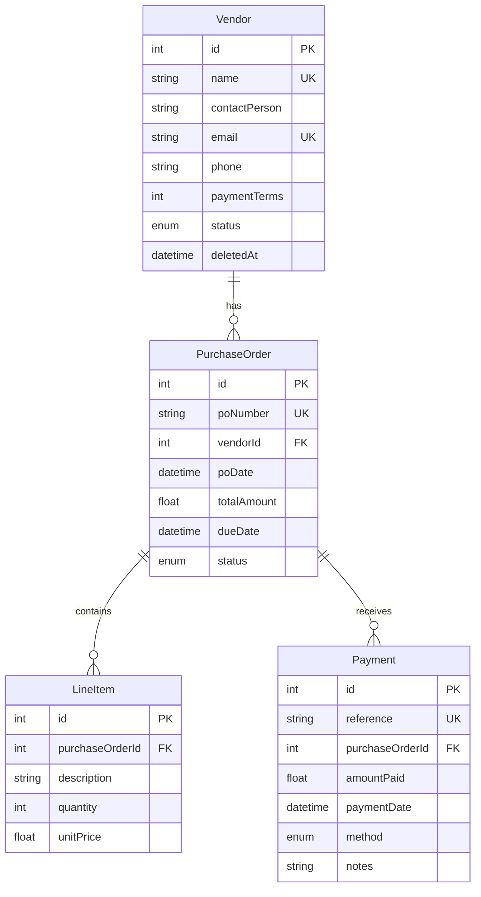

# MSME Vendor Payment Tracking System

A robust backend API for managing vendor payments, purchase orders, and payment tracking built with **NestJS**, **TypeScript**, and **MySQL/Prisma**.

## ✨ Features

- **Vendor Management**: CRUD operations with payment summary
- **Purchase Orders**: Create, filter, and track PO with line items
- **Payment Recording**: Transaction-based payments with overpayment prevention
- **Analytics**: Vendor outstanding and payment aging reports
- **JWT Authentication**: Secure all endpoints
- **Soft Deletes**: Mark vendors as deleted without losing data

## 🛠 Tech Stack

| Technology | Version | Purpose |
|------------|---------|---------|
| NestJS | 10.x | Backend Framework |
| TypeScript | 5.x | Programming Language |
| Prisma | 6.x | ORM |
| MySQL | 8.x | Database |
| JWT | - | Authentication |
| class-validator | 0.14.x | Request Validation |

## 📁 Project Structure

```
src/
├── auth/                 # JWT Authentication
│   ├── dto/
│   ├── auth.controller.ts
│   ├── auth.service.ts
│   ├── jwt.strategy.ts
│   └── jwt-auth.guard.ts
├── vendor/               # Vendor Module
│   ├── dto/
│   ├── vendor.controller.ts
│   └── vendor.service.ts
├── purchase-order/       # Purchase Order Module
│   ├── dto/
│   ├── purchase-order.controller.ts
│   └── purchase-order.service.ts
├── payment/              # Payment Module
│   ├── dto/
│   ├── payment.controller.ts
│   └── payment.service.ts
├── analytics/            # Analytics Module
│   ├── analytics.controller.ts
│   └── analytics.service.ts
├── prisma/               # Prisma Database Service
├── common/               # Utilities & Filters
└── main.ts               # Application Entry
```

## 🗃 Database Schema



## 🚀 Quick Start

### Prerequisites

- Node.js v18+
- MySQL 8.x
- npm

### Installation

```bash
# Clone repository
git clone https://github.com/Codeguruu03/vendor_payment_tracking_system.git
cd vendor_payment_tracking_system

# Install dependencies
npm install

# Setup environment variables
cp .env.example .env
# Edit .env with your MySQL credentials

# Run database migration
npx prisma migrate dev

# Seed database with sample data
npx prisma db seed

# Start development server
npm run start:dev
```

Server runs at: `http://localhost:3000`

## 🔐 Authentication

All endpoints (except login) require JWT token.

**Hardcoded Users:**
| Username | Password | Role |
|----------|----------|------|
| admin | admin123 | admin |
| user | user123 | user |

### Login

```bash
POST /auth/login
Content-Type: application/json

{
  "username": "admin",
  "password": "admin123"
}
```

**Response:**
```json
{
  "access_token": "eyJhbGciOiJI...",
  "user": { "id": 1, "username": "admin", "role": "admin" }
}
```

Use token in requests:
```
Authorization: Bearer <access_token>
```

## 📚 API Endpoints

### Vendors

| Method | Endpoint | Description |
|--------|----------|-------------|
| POST | `/vendors` | Create vendor |
| GET | `/vendors` | List all vendors |
| GET | `/vendors/:id` | Get vendor with payment summary |
| PUT | `/vendors/:id` | Update vendor |
| DELETE | `/vendors/:id` | Soft delete vendor |

### Purchase Orders

| Method | Endpoint | Description |
|--------|----------|-------------|
| POST | `/purchase-orders` | Create PO |
| GET | `/purchase-orders` | List POs (filter by vendorId, status) |
| GET | `/purchase-orders/:id` | Get PO with payment history |
| PATCH | `/purchase-orders/:id/status` | Update PO status |

### Payments

| Method | Endpoint | Description |
|--------|----------|-------------|
| POST | `/payments` | Record payment |
| GET | `/payments` | List all payments |
| GET | `/payments/:id` | Get payment details |

### Analytics

| Method | Endpoint | Description |
|--------|----------|-------------|
| GET | `/analytics/vendor-outstanding` | Outstanding by vendor |
| GET | `/analytics/payment-aging` | Aging report (0-30, 31-60, 61-90, 90+ days) |

## 📝 Request/Response Examples

### Create Vendor

```bash
POST /vendors
Authorization: Bearer <token>

{
  "name": "Acme Corporation",
  "contactPerson": "John Smith",
  "email": "john@acme.com",
  "phone": "9876543210",
  "paymentTerms": 30,
  "status": "ACTIVE"
}
```

### Create Purchase Order

```bash
POST /purchase-orders
Authorization: Bearer <token>

{
  "vendorId": 1,
  "items": [
    { "description": "Steel Rods", "quantity": 100, "unitPrice": 50 },
    { "description": "Steel Plates", "quantity": 50, "unitPrice": 100 }
  ]
}
```

**Auto-calculated:**
- `poNumber`: `PO-YYYYMMDD-XXX`
- `totalAmount`: Sum of (quantity × unitPrice)
- `dueDate`: PO date + vendor's payment terms

### Record Payment

```bash
POST /payments
Authorization: Bearer <token>

{
  "poId": 1,
  "amount": 2500,
  "method": "UPI",
  "notes": "First installment"
}
```

**Payment Methods:** CASH, CHEQUE, NEFT, RTGS, UPI

## 🎯 Business Logic

1. **Vendor Creation**: Name and email must be unique
2. **PO Creation**: 
   - Cannot create PO for INACTIVE vendors
   - Due date auto-calculated from vendor payment terms
   - Total = Sum of line items
3. **Payment Recording**:
   - Cannot overpay (amount ≤ outstanding)
   - Cannot pay DRAFT POs
   - Auto-updates PO status (PARTIALLY_PAID / FULLY_PAID)
4. **Soft Deletes**: Vendors marked with `deletedAt` timestamp

## 🔧 Design Decisions

1. **Prisma ORM**: Type-safe database queries with auto-generated types
2. **Global JWT Guard**: All routes protected by default, use `@Public()` for exceptions
3. **Transaction for Payments**: Ensures atomicity of payment + status update
4. **Soft Deletes**: Preserve data integrity while allowing "deletion"
5. **Auto-generated IDs**: PO-YYYYMMDD-XXX and PAY-YYYYMMDD-XXX formats

## 🧪 Available Scripts

```bash
npm run start:dev    # Development with hot-reload
npm run build        # Build for production
npm run start:prod   # Production mode
npm run prisma:seed  # Seed database
npm run prisma:studio # Open Prisma Studio (DB GUI)
```

## 📄 License

MIT
